# Intelligent Job List Collection AI Agent


## The Objective
Transform LinkedIn Job Alerts into a Structured Notion Database

### The Issues
- Email Overwhelm
- Manual email filtering on LinkedIn job alerts
- One-by-one email opening to check job details  
- Repetitive daily work, repetitive job positions
- Manual input into Notion database
- Approximately spend 1 hour each day ( ~46 days / year), only on sorting, searching, clicking, and organizing those roles


**🤖 Cursor Prompt**: 

> *"I want to build an AI agent that automatically reads job alerts from my emails and neatly organizes them into my Notion database. Are there any free tools I can use?"*
> 
> **→ After research, I found n8n is perfect for this - it's a free, visual workflow automation platform that can handle email parsing, data transformation, and database integration seamlessly.**


### System Overview

```
┌─────────────────────────────────────────────────────────────────┐
│                    Job Collection System Architecture           │
└─────────────────────────────────────────────────────────────────┘

🔄 Gmail Email Parsing (For Closed Platforms)
┌─────────────────┐    ┌─────────────────┐    ┌─────────────────┐
│   Gmail Alerts  │───▶│   n8n Workflow  │───▶│   Notion DB     │
│                 │    │                 │    │                 │
│ • LinkedIn      │    │ • Gmail Nodes   │    │ • Job List      │
│                 │    │ • Email Parser  │    │ • Deduplication │
│                 │    │ • Notion Nodes  │    │ • Search        │
└─────────────────┘    └─────────────────┘    └─────────────────┘
```

## 🔧 Technical Stack - Your Favorite Tools

| Category | Tool | Purpose | Details |
|----------|------|---------|---------|
| **Workflow** | n8n | Workflow Engine | Visual automation platform |
| **Infrastructure** | Docker & Docker Compose | Containerization | Local execution, multi-container orchestration |
| **Database** | Notion | Data Storage | Unified job database |
| **Email** | Gmail API | Email Processing | LinkedIn job alerts retrieval |
| **AI** | Cursor (Pro) | AI Integration | $20/mo + GitHub sync |
| **Code** | JavaScript/Node.js | Code Processing | Job parsing and data processing |


## 🛠️ Processes and Prompts: Step-by-Step Node Setup Guide

### How to Build Each Node (with Cursor AI Prompts)

**🤖 Cursor Prompt**: 
> "Set up a timer that automatically runs twice a day (10 AM and 8 PM) to check for new LinkedIn job emails"

#### 1. **Schedule Trigger Node**
**Purpose**: Automatically run the workflow twice daily

**Setup Steps**:
- Add "Schedule Trigger" node
- Set Cron: `0 10 * * *` (10:00 AM) and `0 20 * * *` (8:00 PM)
- Set Timezone: America/Los_Angeles
- Enable the trigger

**🤖 Cursor Prompt**:
> "Connect to Gmail and get the latest LinkedIn job alert emails."

#### 2. **Gmail (Get Many) Node**
**Purpose**: Retrieve list of LinkedIn job alert emails

**Setup Steps**:
- Add "Gmail" node
- Set Resource: Message
- Set Operation: Get Many
- Set Limit: 20
- Add Filter: `from:jobalerts-noreply@linkedin.com`
- Configure Gmail OAuth2 credentials:
  1. Go to [Google Cloud Console](https://console.cloud.google.com/)
  2. Create a new project or select existing one
  3. Enable Gmail API: [Gmail API](https://console.cloud.google.com/apis/library/gmail.googleapis.com)
  4. Go to [Credentials](https://console.cloud.google.com/apis/credentials)
  5. Create OAuth 2.0 Client ID
  6. Set authorized redirect URI: `http://localhost:5678/rest/oauth2-credential/callback`
  7. Copy Client ID and Client Secret to n8n credentials


**🤖 Cursor Prompt**:
> "I can't understand the time format you're giving me, I need to maintain the order of emails by local time when they were received"

#### 3. **Code (Time Converter) Node (learning by doing)**
**Purpose**: Convert Unix timestamps to readable format

**Setup Steps**:
- Add "Code" node
- Set Mode: Run Once for All Items
- Set Language: JavaScript
- Copy code from `time_converter.js`
- Ensure timezone: America/Los_Angeles


**🤖 Cursor Prompt**:
> "Read each of my emails one by one, extract every job position into separate rows, get the job titles, links, work type and the local time when I received the emails"

#### 4. **Loop Node**
**Purpose**: Process each email individually
**Setup Steps**:
- Add "Loop Over Items" node
- Set Mode: Run Once for Each Item
- Set Batch Size: 1
- Connect from Time Converter output

#### 5. **Gmail (Get) Node**
**Purpose**: Get full content of each email

**Setup Steps**:
- Add "Gmail" node inside loop
- Set Resource: Message
- Set Operation: Get
- Set Message ID: `={{ $json.id }}`
- Set Format: Full
- Use same Gmail credentials

#### 6. **Add EmailTime Node**
**Purpose**: Preserve email metadata through the loop

**Setup Steps**:
- Add "Code" node after Gmail (Get)
- Set Mode: Run Once for Each Item
- Copy code from `add_readable_date.js`
- Preserve email metadata

#### 7. **Code Parser Node**
**Purpose**: Extract job information from email HTML

**Setup Steps**:
- Add "Code" node
- Set Mode: Run Once for Each Item
- Set Language: JavaScript
- Copy code from `job_parser.js`
- Includes deduplication and timezone support

**🤖 Cursor Prompt**:
> "Give me the job list with the information to Notion database - job title, company, link, and work type (remote/hybrid/onsite), now the database is ready, please sync the information in."

#### 8. **Notion Node**
**Purpose**: Store job data in Notion database

**Setup Steps**:
- Add "Notion" node
- Set Operation: Create
- Set Database: Your Job Search database
- Map fields:
  - Job Title: `={{ $json.jobTitle }}`
  - Link: `={{ $json.jobLink }}`
  - Onsite/Remote/Hybrid: `={{ $json.workType }}`
- Configure Notion credentials

# Wrap up into SOP:

```mermaid
flowchart TD
    A[🎯 Be crystal clear on what we want] --> B{🔍 Build or use?<br/>Is any existing product already?}
    B -->|✅ Use existing| C[Use existing solution]
    B -->|🛠️ Build ourselves| D{💰 How much money, time,<br/>efforts we want to invest?}
    D --> E[Build custom solution]
    E --> F[🔄 Prompt back and forth<br/>to finetune, test]
    F --> G[🚀 Use / publish / share]
    C --> G
```




# Appendix

## Product Design

| Aspect | Details |
|--------|---------|
| **Data Source** | Gmail API (LinkedIn job alerts) - limitations: indirect access vs direct LinkedIn API |
| **Format** | By-position list with links, automated sync + manual input capability |
| **Frequency** | Twice daily execution + temporarily use |
| **Volume** | Max hundreds < 1,000 entries (Notion free membership limit) |
| **Cost** | As low as possible - free tier optimization |


## 📁 Cursor Project Structure

### 🔧 Core n8n Workflow Files

| 📄 File | 🎯 Purpose | 🔗 Usage in n8n |
|---------|------------|-----------------|
| `job_parser.js` | Main job parsing logic | **Code Parser node** - extracts job details from LinkedIn emails |
| `time_converter.js` | Timestamp conversion utility | **Code (Time Converter) node** - converts Unix timestamps to readable format |
| `debug_gmail_get.js` | Gmail debugging tool | **Debug node** - inspects Gmail (Get) node output structure |
| `test_current_state.js` | State testing utility | **Test node** - validates current workflow state |
| `gmail_parser.js` | Legacy email parser | **Backup parser** - early version of email parsing logic |

### 🎯 Job Parser Files

| 📄 File | 🎯 Purpose | 🔗 Usage in n8n |
|---------|------------|-----------------|
| `universal_company_parser.js` | **Universal parser** | **Code node** - automatically detects and parses any company/platform |
| `apple_parser.js` | Apple job parser | **Code node** - extracts jobs from Apple career pages |
| `greenhouse_optimized.js` | Greenhouse job parser | **Code Parser node** - extracts jobs from Greenhouse job boards |
| `stripe_parser.js` | Stripe job parser | **Code node** - extracts jobs from Stripe custom job board |
| `notion_job_mapper.js` | Notion integration | **Code node** - maps job data to Notion database schema |
| `test_apple_parser.js` | Apple test suite | **Test node** - validates Apple parser functionality |
| `test_apple_integration.js` | Integration tests | **Test node** - end-to-end testing for Apple parser |
| `apple_job_filter_example.js` | Filter examples | **Code node** - job filtering and search examples |

### 🐍 API Service Files

| 📄 File | 🎯 Purpose | 📝 Description |
|---------|------------|----------------|
| `app.py` | Flask API service | Python web service for content analysis and file processing |
| `llm_rag_service.py` | LLM RAG service | AI-powered chat and analysis service |
| `requirements.txt` | Python dependencies | Flask, PyPDF2, BeautifulSoup4, pandas, matplotlib, plotly |

### 🐳 Deployment & Infrastructure

| 📄 File | 🎯 Purpose | 📝 Description |
|---------|------------|----------------|
| `Dockerfile` | Container configuration | Builds Python API service container with Flask |
| `docker-compose.yml` | Service orchestration | Multi-service setup: n8n, API, and LLM RAG services |
| `workflows/` | n8n workflow templates | Sample workflows for different use cases |
| `workflows/apple_job_collector.json` | Apple job collector | **n8n workflow** - automated Apple job collection |

### ⚙️ Configuration & Documentation

| 📄 File | 🎯 Purpose | 📝 Description |
|---------|------------|----------------|
| `config_backup.md` | Configuration backup | Contains all API credentials and settings (⚠️ **NOT in Git**) |
| `README.md` | Project documentation | Complete setup and usage guide |
| `LICENSE` | MIT License | Open source license |


## 🚀 Setup Instructions

### 📋 Prerequisites

- ✅ Docker and Docker Compose
- ✅ Gmail API credentials
- ✅ Notion API access
- ✅ Cursor Pro subscription


### 🐳 Quick Start with Docker

1. **Clone the repository**
   ```bash
   git clone https://github.com/Apple008811/n8n-ai-agent-job-search.git
   cd n8n-ai-agent-job-search
   ```

2. **Start services with Docker Compose**
   ```bash
   docker-compose up -d
   ```

3. **Access n8n interface**
   - 🌐 Open http://localhost:5678
   - ⚙️ Complete n8n setup wizard

4. **Access API service**
   - 🔌 API available at http://localhost:5002
   - ❤️ Health check: http://localhost:5002/health

> ⚠️ **Important**: Docker containers run locally and require your computer to be powered on. The automated job collection (scheduled at 10:00 AM and 8:00 PM daily) will only execute when your computer is running and the containers are active. If your computer is shut down or in sleep mode, the scheduled tasks will not trigger.


### Core Principles

- **Modular Design**: Each agent is independent and can be maintained separately
- **Unified Data Format**: All data sources output the same structure
- **Configuration-Driven**: Easy to add new data sources through configuration
- **Backward Compatible**: New features don't affect existing functionality

### n8n Code Node Limitations

**Sandbox Environment**: n8n Code nodes run in a sandboxed environment with the following restrictions:
- **No Global State**: Cannot access global variables or maintain state across executions
- **No Persistence**: Each execution is isolated and cannot remember previous data
- **Limited Scope**: Cannot access system resources, files, or external APIs directly
- **Cross-Execution Deduplication**: Cannot implement true global deduplication across multiple workflow runs


## 🔧 Configuration

#### Workflow Node Configuration

| Node | Purpose | Configuration | Key Details |
|------|---------|---------------|-------------|
| **Schedule Trigger (Morning)** | Daily morning execution | • Cron: "0 10 * * *" (10:00 AM)<br>• Timezone: Local<br>• Active: True | • Triggers Gmail collection<br>• Captures overnight job alerts<br>• First daily execution<br>• **Requires computer to be powered on** |
| **Schedule Trigger (Evening)** | Daily evening execution | • Cron: "0 20 * * *" (8:00 PM)<br>• Timezone: Local<br>• Active: True | • Triggers Gmail collection<br>• Captures afternoon job alerts<br>• Second daily execution<br>• **Requires computer to be powered on** |
| **Gmail (Get Many)** | Retrieve email list | • Resource: Message<br>• Operation: Get Many<br>• Limit: 20<br>• Search: "newer_than:1d"<br>• Sender: "jobalerts-noreply@linkedin.com" | • AND relationship for filters<br>• Daily latest emails only<br>• Strict LinkedIn filtering<br>• Output: Email metadata array |
| **Code (Time Converter)** | Convert timestamps | • Mode: Run Once for All Items<br>• Language: JavaScript<br>• Input: Email array with Unix timestamps | • **Critical for deduplication**: internalDate as unique identifier<br>• **Essential for testing**: Human-readable time format<br>• **Dual format**: Preserves original + adds readable format<br>• **Timezone handling**: Converts to America/Los_Angeles |
| **Loop** | Iterate through emails | • Input: Email array from Time Converter<br>• Mode: Run Once for Each Item<br>• Batch Size: 1 | • **Required for individual processing**: Gmail (Get) needs single email ID<br>• **Enables full content retrieval**: Each email processed separately<br>• **Prevents API overload**: Sequential processing vs batch |
| **Gmail (Get)** | Get full email content | • Resource: Message<br>• Operation: Get<br>• Message ID: From Loop<br>• Format: Full | • Retrieves complete HTML content<br>• Required for job parsing<br>• 1 API call per email<br>• **Important**: Does not preserve upstream fields like `readableDate` |
| **Code Parser** | Parse job information | • Language: JavaScript<br>• Input: Full email HTML<br>• Output: Structured job data | • Extracts job titles, companies, links<br>• Handles multiple jobs per email<br>• **Cross-email deduplication logic**<br>• **Pacific Time zone support** |
| **Notion** | Store job data | • Database: Job Search Table<br>• Operation: Create<br>• Fields: Auto-mapped<br>• **Duplicate Check**: Job Title + Company | • Unified job storage<br>• Extensible table structure<br>• **Automatic deduplication** |

### Notion Integration

#### Database Schema

| Field | Type | Description | Auto/Manual |
|-------|------|-------------|-------------|
| Job Title | Title | Position name | Auto |
| Link | URL | Application link | Auto |
| Onsite/Remote/Hybrid | Select | Work type | Auto |
| Apply Date | Date | Application date | Manual |
| Status | Select | Application status | Manual |
| Re-apply | Checkbox | Re-application flag | Manual |

#### Critical Setup Steps

1. **Create Notion Integration**
   - Go to https://www.notion.so/my-integrations
   - Create new integration: "n8n Job Search AI Agent"
   - Select workspace: "Yixuan Jing's Notion HQ" (not Private)
   - Copy Internal Integration Secret

2. **Database Creation**
   - Create database in Notion with 6 fields as shown above
   - Convert simple table to database (not just a table)
   - Get database ID from URL: `https://notion.so/database-id`

3. **Access Permissions**
   - In integration settings, go to "Access" tab
   - Add database to "Manually selected" permissions
   - Ensure integration has access to the database


## 📊 Performance & Monitoring

### API Rate Limits

#### Gmail API Quota Details

| Quota Type | Limit | Our Usage | Status |
|------------|-------|-----------|---------|
| **Daily Requests** | 1,000,000 requests/day | ~50 requests/day | ✅ 0.005% of limit |
| **Rate Limit** | 100 requests/second | ~1 request/second | ✅ Well within limit |
| **Monthly Usage** | ~30,000,000 requests | ~2,500 requests | ✅ 0.008% of limit |
| **Annual Usage** | ~365,000,000 requests | ~30,000 requests | ✅ 0.008% of limit |

#### Current Workflow Usage

| Operation | Frequency | Daily Calls | Monthly Calls |
|-----------|-----------|-------------|---------------|
| Schedule Triggers | 2 times/day (10:00 AM, 8:00 PM) | 2 triggers | 60 triggers |
| Gmail (Get Many) | 2 times/day | 2 calls | 60 calls |
| Loop (20 emails) | 2 times/day | 40 calls | 1,200 calls |
| Gmail (Get) | 2 times/day | 40 calls | 1,200 calls |
| **Total** | - | **82 calls** | **2,460 calls** |

### Deduplication Strategy

| Method | Criteria | Implementation | Benefits |
|--------|----------|----------------|----------|
| **Primary Key** | Job Title + Company | Notion database unique constraint | • Prevents exact duplicates<br>• Handles LinkedIn re-sends<br>• Database-level protection |
| **Content Hash** | Email content hash | Code Parser JavaScript logic | • Detects similar job postings<br>• Handles minor variations<br>• Application-level filtering |
| **Time Window** | 24-hour overlap | Gmail search "newer_than:1d" | • Natural deduplication<br>• Prevents old job re-processing<br>• Efficient API usage |

### Personal Usage Time Investment

For individual users, the time investment is minimal and practical:

- **New Parser Development**: 1-2 hours
  - Quick analysis of job board structure
  - Copy and modify existing parser template
  - Test and validate functionality
  - Deploy to n8n workflow

- **Regular Maintenance**: 30 minutes per month
  - Check if all parsers are working correctly
  - Verify data quality in Notion database
  - Clean up any duplicate entries
  - Update documentation if needed

- **Issue Resolution**: On-demand basis
  - Fix parsing issues when they occur
  - Update selectors when websites change
  - Troubleshoot n8n workflow problems
  - No complex monitoring or alerting needed

### Security Considerations

- OAuth2 authentication for Gmail
- Secure credential storage
- Rate limiting to prevent abuse
- Data privacy compliance


## 🤝 Contributing

This project is designed for personal use but can be extended for broader applications.

## 📄 License

Private project for personal career development.